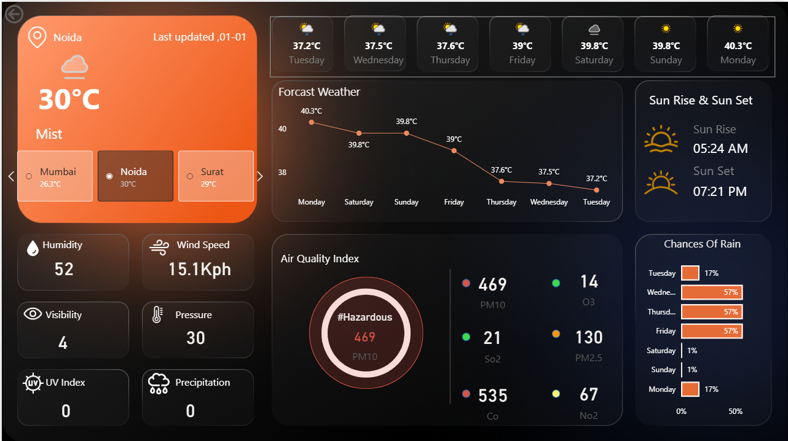

🌤️ Weather Forecast Dashboard — Power BI

1.Project Title

A dynamic, real-time weather monitoring dashboard built with Microsoft Power BI, integrated with a free Weather API to display live weather data, air quality, and forecasts for multiple cities across India.

2.📝 Short Description 

The Weather Forecast Dashboard is a visually engaging and analytical Power BI report designed to help users monitor and explore real-time weather conditions across multiple Indian cities. The dashboard focuses on highlighting key weather metrics like temperature, air quality index, precipitation probability, and astronomical data. This tool is intended for daily personal use, academic projects, travel planners, and data enthusiasts who want to explore live API integration with Power BI.

3.🛠️ Tech Stack

The dashboard was built using the following tools and technologies:

📊 Power BI Desktop — Main data visualization platform used for report creation
🌐 WeatherAPI.com — Free REST API providing real-time, forecast, and astronomical weather data
📂 Power Query (M Language) — Data transformation, JSON parsing, and cleaning layer for reshaping API responses
🧠 DAX (Data Analysis Expressions) — Used for calculated measures, dynamic visuals, and conditional logic
📝 Data Modeling — Relationships established among current weather, forecast, air quality, and astronomy tables to enable cross-filtering
📁 File Format — .pbix for development and .png for dashboard previews

4.🔌 Data Source

Source: WeatherAPI.com — Free Tier
Data is fetched in real time using Power BI's Web connector via HTTP GET requests. The API returns data in JSON format, which is parsed and transformed inside Power Query. The following endpoints are used:
EndpointData Fetched/current.jsonLive temperature, humidity, wind speed, condition/forecast.json7-day forecast, hourly data, rain probability/forecast.json?aqi=yesPM10, PM2.5, SO2, O3, CO, NO2 air quality readings/astronomy.jsonSunrise, sunset, moonrise, moonset times

5.✨ Features 

🔴 Business Problem
Weather information is scattered across multiple apps and platforms, and most tools don't allow users to compare weather conditions across cities in one unified view. Key questions such as:

Which city has the worst air quality today?
What are the chances of rain this week in my city?
What time does the sun rise and set today?

…are difficult to answer quickly without a centralized, data-driven dashboard.

🎯 Goal of the Dashboard
To deliver an interactive visual tool that:

Enables users to monitor real-time weather across multiple cities in one place
Supports decisions such as travel planning, outdoor scheduling, and health awareness based on AQI levels
Uncovers trends in temperature, precipitation, and air pollution by city and day

🖼️ Walkthrough of Key Visuals
Key KPIs (Top Section)

Current Temperature: 30°C
Weather Condition: Mist
Humidity: 52%
Wind Speed: 15.1 Kph
Visibility: 4 km
Pressure: 30
UV Index: 0
Precipitation: 0

Multi-City Selector (Left Panel)

An interactive city selector lets users switch between cities like Mumbai, Noida, Surat, and more — all visuals update instantly based on selection.
7-Day Forecast Cards (Top Bar)

Horizontal cards display daily maximum temperatures and weather condition icons for the next 7 days — from Tuesday through Monday — giving a quick weekly overview at a glance.
Forecast Weather Line Chart (Center)

A line chart showing the temperature trend across the next 7 days with data labels on each point. Helps users identify upcoming hot or cool days at a single glance.
Air Quality Index Panel (Bottom Center)

A circular AQI gauge showing overall air quality status (e.g. #Hazardous)
Individual pollutant readings color-coded for severity:

🔴 PM10 — 469 | 🟢 O3 — 14
🟢 SO2 — 21 | 🟡 PM2.5 — 130
🔴 CO — 535 | 🟡 NO2 — 67

Sunrise & Sunset Panel (Top Right)

Displays exact astronomical times for the selected city:

🌅 Sunrise: 05:24 AM
🌇 Sunset: 07:21 PM

Chances of Rain Bar Chart (Bottom Right)

A horizontal bar chart showing day-wise precipitation probability in % for the upcoming week — helping users plan outdoor activities well in advance.

💡 Business Impact & Insights

Health Awareness — Users can monitor AQI levels and take precautions on hazardous air quality days, especially relevant for cities like Noida with high pollution levels
Travel Planning — Tourists and commuters can compare weather across cities and choose the best time and destination for travel
Outdoor Scheduling — Rain probability charts help individuals and event planners make informed decisions about outdoor activities
Academic & Portfolio Use — Demonstrates real-world API integration, JSON transformation, and advanced DAX in Power BI — ideal for data analyst portfolios.

6.Dasboard Overview

